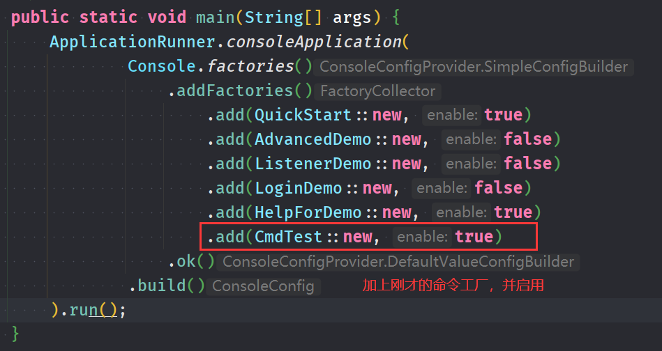

# JConsoleApplication
> 基于`Java8`，开发控制台应用的轻量级的框架，简化控制台应用的开发过程，简单易用同时支持多种扩展方式。
>
> 框架的核心功能是使用一个容器管理命令工厂中的`java`方法，使得其他位置可以不受限制的调用容器管理的方法并接收执行结果，同时框架提供一个命令解释器，可以将字符串格式的命令映射到`java`方法的参数上并执行，可以像执行`liunx`命令一样调用`java`方法，命令名称即是方法名称，命令参数即是方法参数。
>
> 以此为基础扩展出其他实用的功能，例如应用事件监听器，命令执行条件、自定义类型解析，变量、可选参数和参数默认值等。
>
> 另外框架提供了多种开始方式，用于不同的应用场景。

- 注解式开发，通过标记注解实现对应的功能


<div align = "center">** 2020-12-27  ~  2021-1-13 **</div>
<div align = "center">flutterdash@qq.com</div>
<div align = "center">last updated : 2021-1-15</div>  


## 相关技术

`Java8`、`maven`、注解、反射

几乎不使用第三方库，所以框架体量非常小，所有功能都由代码实现，仅有的两个依赖其中一个是单元测试，只在演示应用启动时使用，另外一个是`lombok`插件，后续可能会移除这个依赖。


## 更新记录

- **20/1/14**  增加变量功能，增加预设命令`get`、`set`、`echo`，通过占位符使用变量，变量可以做为命令的参数，`set`可以使用命令方法的返回值做为变量的值.

  `help get`  `help set` 

- **20/1/15**  占位符预设随机整型和随机布尔功能。占位符能获取变量的域。

- **20/1/16**  增强`echo`命令的功能，除了输出变量的实际值之外，还能输出变量的类型，`echo`命令不限制参数的数量。

  查看命令 `help echo`

- **20/1/16**  除了系统的参数解析方式，可以使用不经过处理的命令参数做为方法参数。


## 基本功能

> 像调用`liunx`命令一样调用`java`方法

### 命令的语法

先说一下主要的语法

- **基本命令语法:** 一条命令主要由**命令名**和**命令参数**构成，例如`add 12 13`，这一条命令中`add`是命令名，对应一个名为add的方法，`12`和`13`是命令参数，也对应add方法的参数，当方法没有参数时，命令也不需要参数。

- **命令的别名:** 一个方法对应一个命令，但是一个命令还可以有一个别名，举个例子:

  ```java
  @Cmd(name = "man")
  public void help() {
      System.out.println("hello world!");
  }
  ```

  输入`man`或者`help`效果相同，都会在控制台上输出`hello world!`

- **可选参数:**  当一个方法有多个参数，但是这些参数并不都是必要的，可以通过框架的`@Opt`注解实现可选参数功能，例如：

  ```java
  @Cmd
  public void get(@Opt('a') boolean a, @Opt('b') boolean b, @Opt('c') boolean c) {
  }
  ```

  对于`@Opt`注解的其他用法后面会提到，就这样的一个方法，每个方法参数上都有这个注解，并且有一个字符来标识这个参数，这样我们可以这样调用这个方法

  `get -a true -b true -c true`

  这条命令中，有三组参数项，第一组是`-a true`，其中`-a`是**参数名**，对应方法参数`a`，`true`是**参数的值**，这个值会被解析后映射到方法参数`a`上，后面的以此类推，在方法中可以观察到，abc三个传进来的参数都是`true`了。

  当然，对于布尔值有更简便的写法，如：

  `get -a -b -c`

  还能更简单：

  `get -abc`

  这些可选参数的出现顺序是没有要求的，而且设置参数属性的方式可以在一条命令中混合出现，例如:

  `get -b -ac`  等于 `get -a true -b -c true`  等于 `get -c -b -a`

  **注意:** 标记了`@Opt`注解后，如果命令中没有对此方法参数设置值，则这个方法参数为默认值。布尔类型为`false`，数值类型为`0`，引用类型为`null`，举例子: 还是上面的方法，如果这个时候输入命令`get -ac`，在方法中观察，则`a`和`c`为`true`，`b`为`false`

- **参数的全称和简称:** 在`@Opt`注解中，可以指定一个属性`fullName` , 比如下面的一个方法：

  ```java
  @Cmd
  public void find(@Opt(value = 's', fullName = "name") String name, @Opt('a') int age) {}
  ```

  这样的一个方法，可以这样调用:

  `find -s jack`  或者 `find --name jack` ， 这两个命令效果相同。

  **注意:** 如果一个方法上的参数都有`@Opt`注解，那么可以按照方法参数的顺序来填充属性，例如上面的方法可以这样调用

  - `find jack`  等于在代码中调用 `find("jack", 0)`; 
  - `find jack 11` 等于`find("jack", 11)`
  
- **集合:**  可以在方法参数中使用集合，例如数组，列表、集

  ```java
  @Cmd
  public void show(int[] arr, List<Double> list, Set<String> set) {
      System.out.println(arr);
      System.out.println(list);
      System.out.println(set);
  }
  ```

  命令中用英文逗号将各个数据项分隔

  `show 1,2,3,1 1,2,3,1 1,1,1,2`


### 启动配置

有两种开始方式，第一种启动后会在控制台等待输入，根据控制台的输入进行处理命令，将结果在控制台输出。另外一种是获取一个解释器对象，由解释器在解析字符串格式的命令。

- **启动控制台应用**

  需要编写一个用于启动的`main`方法，然后在`main`方法中调用`ApplicationRunner.consoleApplication(conf)`这个方法，方法参数是对于控制台应用的一些配置，以下是完整的启动及配置示例:

  ```java
  public static void main(String[] args) {
      ApplicationRunner.consoleApplication(
              Commons.config()
                      // 应用信息
                      .appName("测试应用示例")  // 应用的名称
                      .printWelcome(false)    // 是否打印欢迎信息
                      .prompt("example> ")    // 控制台输入的提示符
                      .printStackTrace(false) // 遇到异常时是否打印调用栈
                      .exitCmd(new String[] {"exit", "e.", "q"}) // 使用这些命令可以退出应用
                      .maxHistory(128) // 最多保存的历史记录数量
                      .enableVariableFunction(true) // 开启变量功能，get set命令可用，占位符功能可用
                      // 编辑作者信息，当printWelcome设置为false时，这些信息不会被输出
                      .editAuthorInfo()
                          .authorName("fd")
                          .email("~~")
                          .comment("备注: ~~")
                          .createDate("2020/12/27")
                          .updateDate("2021/1/11")
                          .ok()
                      // 设置系统启动时执行的命令
                      .addInitCommands()
                          .getFromFile("init.txt") // 从文件中读取
                          .add("find --tag usr")   // 查询所有的用户命令
                          .add("help --name help") // 获取 help 命令的使用帮助
                          .ok()
                      // 增加命令工厂，enable参数决定是否启用该命令工厂，将false修改为true可以开启对应命令工厂的测试，
                      // 但是为了方便功能演示，建议测试以下几个类的时候，每次只有一个工厂类enable为true
                      .addCommandFactories()
                            .add(QuickStart.class, true) // 使用Class对象，可以实例化private的无参构造器，但是可能会导致系统中存在多个实例
                            .add(AdvancedDemo::new, false) // 构造器引用，同样存在导致系统中多例的问题
                            .add(ListenerDemo.INSTANCE, false) // 使用已存在的对象做为命令工厂，单例
                            .add(LoginDemo.class, false)
                            .ok()
                      .addHelpFactory(HelpForDemo.INSTANCE) // 加入命令帮助
                      // 设置完成，应用启动
                      .build()).run();
  }
  ```

  启动效果

    
  `example> `上面的这些内容是配置中执行了`find --tag usr` 和`help --name help`这两个命令输出的结果，这两个命令都是系统预置的，无需编写任何额外的代码就能用的命令，像这样的命令还有好几个，后面会写。
  
  先说一下，这里`find --tag usr` 是输出当前注册到系统中的用户命令，每一条是命令对应的方法原型，也就是方法所在的类，参数，和返回值。查询系统命令使用`find --tag sys`
  
- **创建命令工厂**

  新建一个类做为命令工厂，甚至无需新建类，任何类都可以做为命令工厂，在这个类中需要用命令来调用的**实例方法**上标记`@Cmd`注解，然后启动应用后就能在控制台上根据命令调用这些方法了

  有两点需要注意：

  - 标记`@Cmd`注解的方法必须是非静态方法才能被系统识别，方法的访问属性不做要求，`private`或者`public`都行。
  - 做为命令工厂，这个类必须提供无参的构造方法，否则系统无非实例化这个类。

  




### 解释器

框架的第二种启动方式，获取一个解释器。

不再从控制台获取输入，解释器如何使用由代码决定，解释器仍然具有调用工厂中的方法的功能。

**获取解释器**

在使用配置信息生成一个解释器对象，只需要进行少量的配置，加入命令工厂即可。

```java
// 使用 Commons.simpleConf() 获取更精简的配置类
Interpreter interpreter = ApplicationRunner.getInterpreter(Commons.simpleConf()
            .printStackTrace(false)
            .addFactory(QuickStart.class, true)
            .build());
```

使用时

```java
// 直接运行命令，得到结果的包装类
InvokeInfo result = interpreter.interpret("add 11 12");
```

解释器执行一条命令后会返回一个`InvokeInfo`对象，这个对象包含了命令执行的一些信息，如执行命令对应的方法，是否执行成功，方法返回值，返回值类型，调用方法实际的参数，执行时遇到的异常，异常信息，执行花费的时间，命令执行日期。这样一些信息。并且此对象提供一些诸如`intValue()`、`floatValue()`这样的方法可以以基本类型获得方法返回值。

使用方法名或者方法别名以参数的形式调用命令

```java
InvokeInfo result = interpreter.invoke("stuAdd", new Student());
```


----

## 扩展功能

> 学习其他功能的使用之前，先介绍一下系统的两个常用注解

### 类型解析

要是经过观察命令的执行过程就会发现一个问题，比如前面演示的命令，`add 1 2`如何映射到add方法上，并且准确的进行了类型转换，这是因为系统中有一个转换工厂，其中有一个Map，记录了所有的基本类型和字符串到此类型的转换方式。

1. 系统接收到键盘输入的命令
2. 根据命令名称找到对应的`java`方法
3. 获取此`java`方法的参数类型列表，将命令参数向方法参数进行映射
4. 逐个按照目标类型进行解析和填充。


### @Cmd 注解

```java
@Retention(RetentionPolicy.RUNTIME)
@Target(ElementType.METHOD)
public @interface Cmd {

    CmdType type() default CmdType.Cmd;
    String name() default "";
    Mode mode() default Mode.SYS;
    Class<?>[] targets() default {};
    String onError() default "";
    int order() default 5;
    String tag() default "usr";

}
```

以上是`@Cmd`注解的源码(去除了注释)，这个注解用于标记在方法上，配合设置这个标记了`@Cmd`注解的方法可以被系统扫描并装配至工厂。

- **type:**  type有5种类型，默认的是`Cmd`，这个代表这个方法可以用字符串命令的命令调用，其他的
  
- `Init` 类型为init的方法不能用命令调用，不能有参数，它的执行时机是在系统所有命令装配完成时，可以根据`order`属性决定init方法的执行顺序。同一个init方法在整个系统中只会被执行一次。
  
- `Pre`  类型为pre的方法不能用命令调用， 不能有参数，返回值必须是布尔类型，它的执行时机是在所有类型为`Cmd`的命令之前被调用，同一个系统可以有多个pre方法，并且这些pre方法可以根据`order`值决定执行顺序。对于返回值，如果返回true表示通过，进行下一个pre方法，或者是执行当前的命令，反之返回了false，则表示过滤阻断，当前命令不被调用。返回false时，`onError`的内容被输出在控制台。
  
- `Destory`  类型为Destory的方法不能被命令调用，不能有参数，这种方法被注册到了系统关闭钩子上，所以会在系统退出时被调用，可以根据`order`属性来决定Destory方法的执行顺序。同一个Destory方法在系统中只会被调用一次，假如系统进程直接被杀，这个方法不会被调用。
  
- `Parser`  解析器。这个类型，是为了解决系统只支持基本类型的转换方式的问题，假如方法参数中要使用其他的引用类型，比如`Date`或者是自定义的类型，那系统就无能为力了，这个时候可以向系统注册自己的类型转换实现，例如这里:
  
    ```java
    @Cmd(type = CmdType.Parser, targets = {Time.class})
    private Time dateConverter(String rawStr) {
        String[] segment = rawStr.split(":");
        return new Time(Integer.parseInt(segment[0]), Integer.parseInt(segment[1]), 0);
    }
    
    @Cmd
    private void getTime(Time t) {
        System.out.println(t);
    }
	```
  启动系统后
    ```bash
    # 输入
    getTime 12:12
    # 输出
    12:12:00
    ```
  
  此时调用`getTime`命令时，`12:12`这个数值以及交由`dateConvertor`方法进行处理了，这里有一点需要注意，`Parser`方法的返回值需要和`@Cmd`注解的`targets`属性一致，使得方法返回值可以转换成`targets`的类型。可以自定义基本类型的处理方式，覆盖系统的默认转换。
  
- **mode:**  目前这个枚举支持两种类型，一个是由系统做参数解析`SYS`，另一个是什么都不做直接给方法调用`DFT`，后续可能会开放用户自定义解析实现的接口。

- **tag:**  给一个命令指定标签，默认的标签是`usr`，代表用户命令的意思，可以改成别的。当系统中命令比较多的时候，要查找某一类功能的命令就比较方便，按照标签查找使用的是系统命令`find`，比如:

  ```bash
  # 查找标签为 usr 的命令
  find --tag usr
  # 查找标签为 sys 的命令
  find --tag sys
  ```

  

  > 查询结果

  这些是此命令所在的类和方法的签名，以及返回值类型，可以按照这个方法名使用`help`或者`man`命令查询详细用法，其他命令后面再写。


### @Opt 注解

```java
@Retention(RetentionPolicy.RUNTIME)
@Target(ElementType.PARAMETER)
public @interface Opt {

    char value();
    String fullName() default "";
    boolean required() default false;
    String dftVal() default "";

}
```

这段代码是这个注解的源码，使用在方法参数上，有4个属性:

- **value:**  在命令中可以用value来为指定的参数赋值，这个功能前面已经介绍过了。
- **fullName:**  这个在之前也介绍过了，指定一个参数的全称，一般使用`--`做为参数名的前缀，效果与value相同。
- **required:**  标记这个参数是否是必选项，默认这个属性是`false`，假如标记为`true`则当命令缺少此参数时方法不会被执行，且抛出异常。
- **dftVal:**  默认值功能，用于在命令中没有选中此参数，则这个参数应用默认值，虽然是这个属性是`String`类型，但是会由系统向目标类型进行转换，只需要写上自己需要的数值的字符串形式就可以了。


### 表单

有时候需要在方法上接收一个`pojo`类的对象，并且希望使用者一项一项地把所有属性输入完成，这个时候可以使用系统的表单功能。

需要用到两个注解。

```java
@Form(dftExtCmd = "-")
public class Student {
    @Prop(prompt = "输入学生姓名", isRequired = true)
    private String name;

    @Prop(prompt = "输入学生年龄")
    private int age;

    // 表单类需要提供一个无参构造方法，private 或者 public 无所谓
    public Student() {
    }
}
```

比如这样的一个类，类上的`@Form`注解表示它是一个表单类，它包含两个域，一个是`name`，一个是`age`，这两个域是希望由使用者键盘输入得到的值，所以上面有`@Prop`注解，其中`name`上的注解`isRequired`属性为true，表示这个属性是必选的，而`age`上没有这个属性，则`age`在输入时是可以跳过的。

下面是使用表单参数的方法。

```java
@Cmd(name = "addStu")
private void addStudent(Student student) {
    System.out.println("姓名： " + student.name);
    System.out.println("年龄： " + student.age);
}
```


对于这两个注解，有以下规则:

- `@Form`注解的`dftExtCmd`的属性可用于在输入过程中退出剩余的属性输入。
- 用于区别可选项和必选项(`isRequired`为true)，可选项的提示符是`~`，必选项的提示符是`!`
- 回车可以跳过当前属性的输入，前提是当前属性是必选项，否则无法跳过。
- 输入了`dftExtCmd`的退出命令后，假如当前输入的是必选项，则无法退出；假如当前是可选项，则跳转到下一条必选项属性的输入，假如余下没有必选项了，则进行选择是否需要对当前的输入修改。
- 在修改模式，输入`dftExtCmd`可以直接退出，无视必选项
- 在修改模式，回车可以跳到下一条属性的检查，无视当前是否是必选项。


### 系统事件监听器

从执行`run()`方法开始，系统有这些执行流程和事件发布的时机

1. `run()`方法调用，根据`config`初始化了装配工厂
2. 装配工厂装配完所有命令，**发布`onAppStarted`事件**，监听此事件可以获得`config`配置对象的引用。
3. 系统初始化完成，等待接收键盘输入，当有新的输入，**发布`onInput`事件**，监听此事件可以获得当前键盘的输入，并且可以将修改后的输入返回给系统处理。
4. 系统将输入按照空格分隔，**发布`onResolveInput`事件**，监听此事件可以得到命令参数和参数值构成的字符串列表，假如需要对参数进行处理，可以监听这个事件。
5. 当命令解析完成，会得到一个执行结果，此时**发布`onInputResolved`事件**，监听此事件可以得到命令执行的返回值

要监听系统中的事件，可以通过让命令工厂实现`AppListener`接口，这个接口有一个`accept(Moment)`方法，这个方法是必须实现的，其他方法可以选择性的重写，在系统遇到某事件的节点的时候，会遍历注册入系统中的监听器，逐个调用`accept`方法，向方法中传递一个表示当前事件的Moment枚举对象，如果对此类事件感兴趣则返回true，比如这样:

```java
@Override
public boolean accept(Moment moment) {
    return moment == Moment.OnInputResolved || moment == Moment.OnAppStarted;
}
```

表示会监听输入解析完成事件和应用开始事件，当系统运行到这两个事件节点的时候，这里对应的方法会被调用。


### 使用变量

<div align = "right"><i>2020-1-15 补充此功能</i></div>

- `get`  在系统预设的命令中，可以使用`set`来设置一些变量，用`get`输出这些变量。  
  

  这样可以给名为`name`的键的值设置为`jack`， 通过`get`将名为`name`的键对应的值显示出来，假如系统中没有这个键，则:  
  

- `keys`  查询系统中所有的键以及对应的值，使用命令`keys`:  
  

- **占位符:**  使用占位符来测试之前的`add`命令, `${}`会被替换成实际的值:    
    
  使用命令的返回值做为一个key的值，实验:  

  创建一个命令方法:  

  ```java
  @Cmd
  private Student getStu() {
    Student student = new Student();
    student.age = 14;
    student.name = "jack";
    return student;
  }
  ```

  这样这个方法不会在控制台输出任何内容，但是它确实是有返回值的，而且可以被系统接收，可以这样做:  

    
  用`set`指定一个键，`stu`，将下一条命令的返回值做为value， 再使用`get`命令查看这个键。
  Student类只包含两个属性，name和age，并且没有重写`toString`方法，所以这里输出的是这个对象的地址，可以观察到，确实是把对象设置到这个键上了。
  再来使用一个命令方法验证这个功能，这个方法会将一个Student对象的内容输出:  

  ```java
  @Cmd(name = "addStu")
  private void addStudent(Student student) {
    System.out.println("姓名： " + student.name);
    System.out.println("年龄： " + student.age);
  }
  ```

    

- 查看某个变量的对象的某属性，以上面的`stu`为例，它是一个`Student`对象，要查看它的属性，使用`echo`命令  
    

- 清除某个key，使用小数点`.`做为值  

    
  清除所有键，命令`set .`  

  

- 使用随机值，目前系统支持随机整型和布尔类型，其中整型支持指定区间

  

  

  

### 系统预置的命令

这部分以及补充了对应的帮助信息，可以通过`find -t sys`查看预设命令的原型，使用`help [命令名]`查看命令的用法，这里就不多赘述了.

- 管理监听器的
  - dis 停用某监听器
  - en 启用某监听器
  - lis 显示系统中正在应用的监听器
- echo 输出变量的实际内容
- set 设置变量
- get 获取变量
- app 应用信息
- his 查询历史命令记录
- sleep 休眠当前程序若干毫秒
- help 查看某命令的帮助信息


### 编写应用的帮助信息

到这就行了，示例代码里都有，也比较简单，这里就不写了。


----

